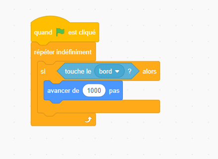

# 1️⃣ COMPRENDRE COMMENT PENSE UNE MACHINE

## 🧩 Ce que l’ordinateur comprend vraiment

Un ordinateur n’est **pas intelligent** : il **exécute exactement ce qu’on lui dit**, ni plus ni moins.  
Il ne comprend que **deux états** :

| État  | Valeur | Métaphore           |
|-------|---------|--------------------|
| Allumé | 1 | Ampoule allumée 💡 |
| Éteint | 0 | Ampoule éteinte ⚫ |

➡️ En combinant des milliards de ces **0** et **1**, on peut représenter **n’importe quelle information** : texte, image, son, vidéo, instructions, etc.

---

## 💬 Exemple concret : lettre et image

- La lettre **A** en binaire : `01000001`  
- Une image : des milliers de pixels codés chacun par 0 et 1  
- Un son : des variations électriques traduites en 0/1  

> 💡 **Métaphore :**  
> Un ordinateur, c’est comme un **orchestre** qui ne joue que deux notes :  
> 🎵 **DO (0)** et **RÉ (1)**.  
> Avec ces deux sons, il peut tout jouer — si le **compositeur (toi)** lui écrit la bonne partition (le programme) !

---

## 🧰 Langages informatiques

| Type | Exemple | Rôle |
|------|----------|------|
| **Langage machine** | `01010110` | Compris directement par la machine |
| **Langage de programmation** | Go, Python, C | Compris par les humains, **traduit ensuite** en machine |
| **Langage de description** | HTML, CSS | Sert à **présenter** ou **décrire**, pas à **calculer** ni **raisonner** |

---

> ⚙️ **Métaphore maison :**  
> - 🧱 **Go** = le cerveau et les circuits électriques de la maison  
> - 🎨 **HTML/CSS** = la déco et les couleurs  
> - ⚡ **Langage machine** = les câbles et interrupteurs derrière les murs


# 2. Blockly Games (par Google)

🔗 https://blockly.games

🕹️ Série de mini-jeux éducatifs où tu fais avancer un personnage ou résoudre des énigmes en construisant des algorithmes avec des blocs.

Labyrinthe → boucles et conditions
Oiseau → logique “si / sinon”
Tortue → dessin avec boucles
Musique / Graphique → fonctions et variables

# Scratch
Tu programmes avec des blocs colorés (pas besoin de taper du code).
Chaque bloc correspond à une instruction logique : bouger, répéter, attendre, tester une condition…
 https://scratch.mit.edu/projects/editor/?tutorial=getStarted

 # 🎮 DE SCRATCH À GO — LA LOGIQUE DE PROGRAMMATION

## 🎯 Objectif
Faire comprendre aux étudiants que :
> Ce qu’ils faisaient en glissant des blocs dans Scratch, c’est **exactement la même logique**, sauf que maintenant, **on écrit les instructions à la main**.

---

## 🧩 1️⃣ LES ACTIONS — "Quand le sprite bouge"

### 🧠 En Scratch :
> Quand on clique sur le drapeau vert → le chat avance de 10 pas.

### 💻 En Go :
> Quand le programme démarre → on affiche un message ou on fait une action.

```go
package main
import "fmt"

func main() {
    fmt.Println("🐱 Le chat avance de 10 pas !")
}
```

💬 Ici, `fmt.Println()` = le bloc **"dire quelque chose"** de Scratch.

---

## 🔁 2️⃣ LES BOUCLES 

### 🧠 En Scratch :
controle => Répéter 10 fois : { avancer de 10 pas }
 
### 💻 En Go :

```go
package main
import "fmt"

func main() {
    for i := 1; i <= 10; i++ {
        fmt.Println("Pas numéro :", i)
    }
}
```

💡 `for` = le bloc “répéter”  
🧩 La variable `i` compte les tours (comme un compteur caché dans Scratch).

---

## ❓ 3️⃣ LES CONDITIONS — "Si touche le bord, rebondir"

### 🧠 En Scratch :
> Si le chat touche le bord  
> alors change de direction ou bien faire 100 pas ...
exemple :


### 💻 En Go :
On ne fait pas encore bouger un vrai chat, mais on peut simuler une condition :

```go
package main
import "fmt"

func main() {
    position := 0

    if position == 8 {
        fmt.Println("Le chat avance de 1000 pas")
    } else {
        fmt.Println("Le chat ne fait rien 🐾")
    }
}
```

💡 `if ... else` = le bloc “si / sinon” de Scratch.  
🧠 Même logique, juste plus explicite.

---

## 📦 4️⃣ LES VARIABLES — "Mettre une valeur dans une boîte"

### 🧠 En Scratch :
> Mettre **score à 0**  
> Ajouter 1 à **score**

### 💻 En Go :

```go
package main
import "fmt"

func main() {
    score := 0
    fmt.Println("Score de départ :", score)

    score = score + 1
    fmt.Println("Score après une action :", score)
}
```

💡 Les variables sont des **boîtes étiquetées** qu’on peut modifier à tout moment.

---

## ⚙️ 5️⃣ LES FONCTIONS — "Créer ton propre bloc"

### 🧠 En Scratch :
> Créer un bloc “saluer joueur”

### 💻 En Go :
> Créer une **fonction** pour saluer.

```go
package main
import "fmt"

// On crée une fonction réutilisable
func Saluer(nom string) {
    fmt.Println("Bonjour", nom, "👋")
}

func main() {
    Saluer("Firas")
    Saluer("Ynov")
}
```

💡 `func` = le bloc Scratch “Créer ton propre bloc”.

---

## 🧩 6️⃣ LES ÉVÉNEMENTS — "Quand on clique sur le drapeau vert"

En Go, il n’y a pas d’événement visuel (comme clic ou touche pressée),
mais on peut simuler une **interaction avec le clavier** 👇

```go
package main
import "fmt"

func main() {
    var action string
    fmt.Print("Tape une action (avancer / sauter) : ")
    fmt.Scan(&action)

    if action == "avancer" {
        fmt.Println("Le joueur avance 🚶")
    } else if action == "sauter" {
        fmt.Println("Le joueur saute 🦘")
    } else {
        fmt.Println("Action inconnue ❌")
    }
}
```

💬 Ici :
- `fmt.Scan()` = lire ce que tape le joueur  
- `if` = choisir la bonne action selon sa réponse  

---

## 🎮 7️⃣ TP — **Créer ton mini-jeu Scratch en Go !**

### 🎯 Objectif :
Recréer la logique d’un petit jeu Scratch… mais en Go.

**Exemple : “Le chat attrape les poissons” 🐟**

### 🔧 Règles :
1. Le chat démarre avec un score à 0  
2. Il demande “As-tu attrapé un poisson ? (oui/non)”  
3. Si oui → +1 point  
4. Si non → rien  
5. Répéter 5 fois, puis afficher le score final  

### 💻 Exemple :

```go
package main
import "fmt"

func main() {
    score := 0

    for i := 1; i <= 5; i++ {
        var reponse string
        fmt.Print("As-tu attrapé un poisson ? (oui/non) : ")
        fmt.Scan(&reponse)

        if reponse == "oui" {
            score++
            fmt.Println("Bravo ! Ton score est maintenant :", score)
        } else {
            fmt.Println("Pas grave, réessaie !")
        }
    }

    fmt.Println("Partie terminée 🎮 Score final :", score)
}
```

---

# 🧠 Ce que les étudiants doivent retenir

| Concept Scratch | Équivalent Go | Ce que ça veut dire |
|------------------|---------------|---------------------|
| Bloc “dire” | `fmt.Println()` | Afficher un message |
| Bloc “répéter” | `for` | Répéter une action |
| Bloc “si / sinon” | `if / else` | Prendre une décision |
| Variable | `var` ou `:=` | Stocker une information |
| Créer un bloc | `func` | Faire une fonction réutilisable |
| Quand drapeau vert cliqué | `main()` | Démarrage du programme |
| Lire entrée | `fmt.Scan()` | Interaction clavier |
